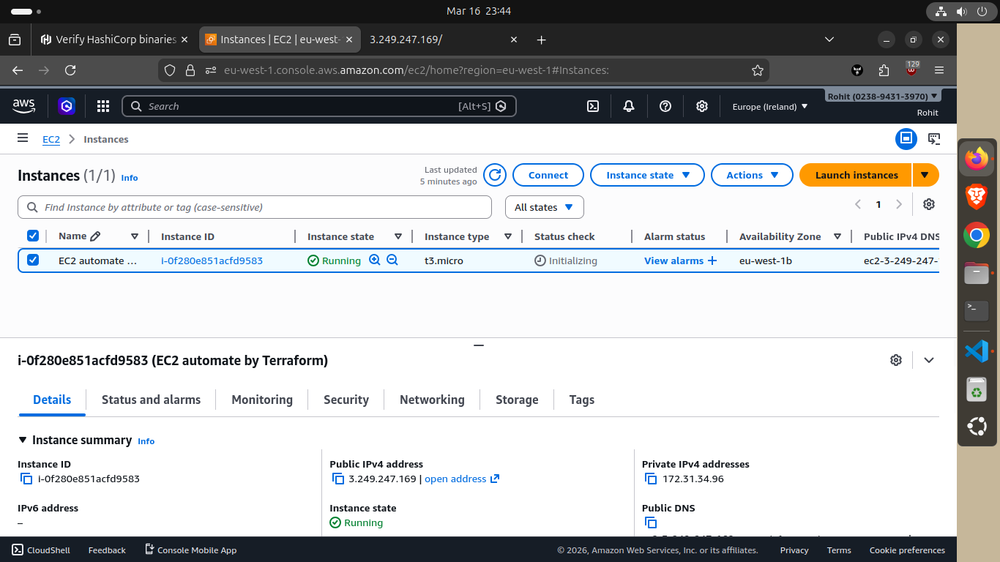
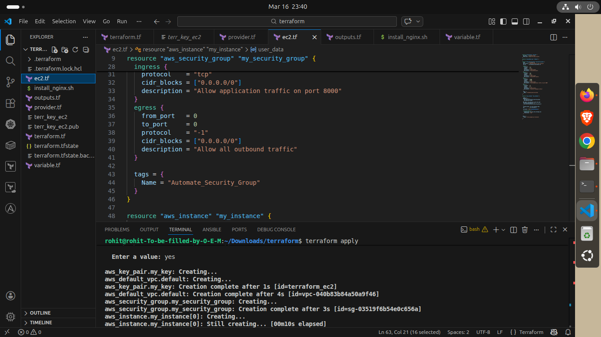
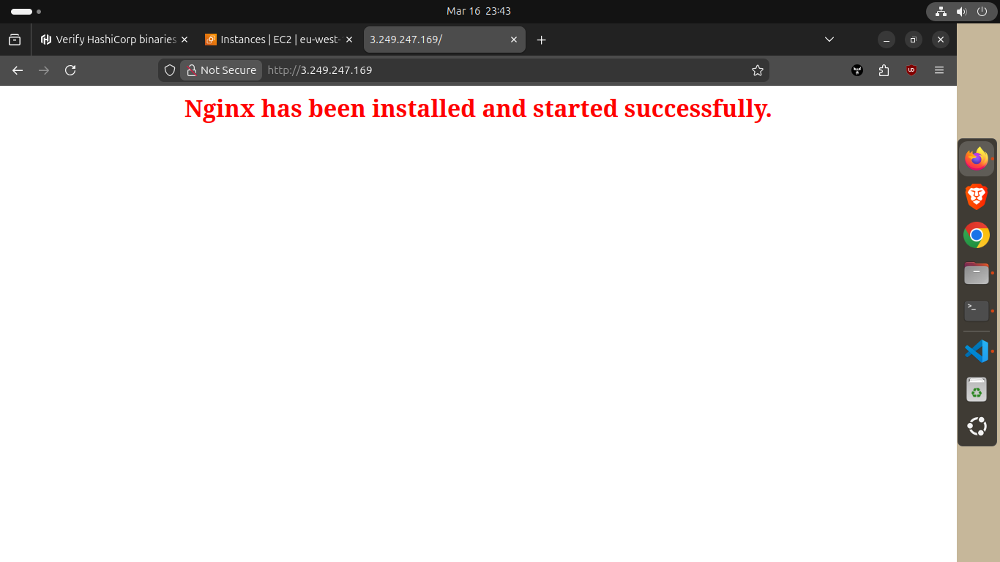
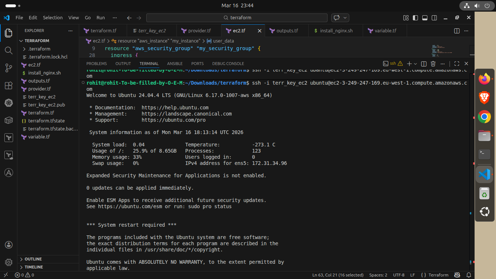

# Terraform EC2 Deployment (AWS)

This project uses Terraform to provision an EC2 instance in AWS, including:

- An EC2 Key Pair (from `terr_key_ec2.pub`)
- The default VPC (queried via `aws_default_vpc`)
- A security group allowing SSH (22), HTTP (80), and app traffic (8000)
- An EC2 instance with a user-data script (`install_nginx.sh`)

---

## Proof of Project Structure

Files included in the workspace:

- `ec2.tf` – EC2 instance, key pair, security group
- `provider.tf` – AWS provider configuration
- `variable.tf` – Terraform variables (AMI, instance type, disk size)
- `install_nginx.sh` – Bootstrapping script run via user data
- `terr_key_ec2` / `terr_key_ec2.pub` – SSH private/public key pair used by Terraform

### Project Proof (Screenshots)

The following images are included under `project-proof/` and show the terraform run output and the deployed EC2 instance.
- 

- 

- 

- 

---

## Prerequisites

1. AWS credentials with permissions to create EC2 resources (EC2 API actions, including `ImportKeyPair`, `DescribeVpcs`, `RunInstances`, etc.).
2. Terraform installed (recommended >= 1.5).
3. `aws` CLI installed (optional, but useful for verification).

---

## How to Run

From the project directory:

1. Ensure your AWS credentials are available (environment variables, shared credentials file, or AWS SSO).
2. (Optional) Format Terraform files:

```bash
terraform fmt
```

3. Initialize and apply:

```bash
terraform init
terraform plan -out plan.tfplan
terraform apply "plan.tfplan"
```

After the apply completes, Terraform will output instance details (public IP / DNS).

---

## SSH Into the Instance

Once Terraform finishes, use the private key `terr_key_ec2` and the correct SSH user for the AMI.

Example for Ubuntu AMIs:

```bash
chmod 600 terr_key_ec2
ssh -i terr_key_ec2 ubuntu@<public-ip>
```

(Replace `<public-ip>` with the instance public IP shown by Terraform.)

---

## Cleanup

To destroy everything created by Terraform:

```bash
terraform destroy
```

---

## Notes !!

- If Terraform fails with `UnauthorizedOperation` errors, your IAM user does not have the required EC2 permissions. You must attach an IAM policy that allows the needed EC2 actions.
- The key pair is imported from `terr_key_ec2.pub` and the private key is stored in `terr_key_ec2`.
