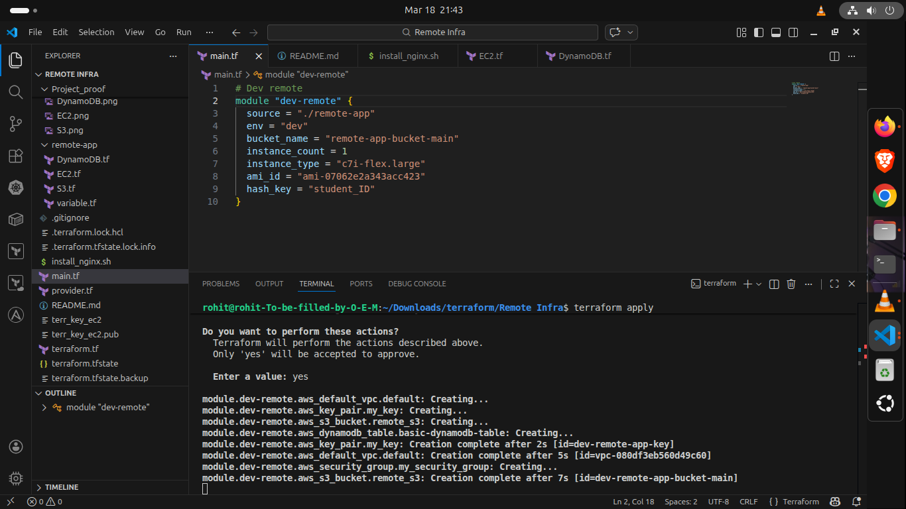
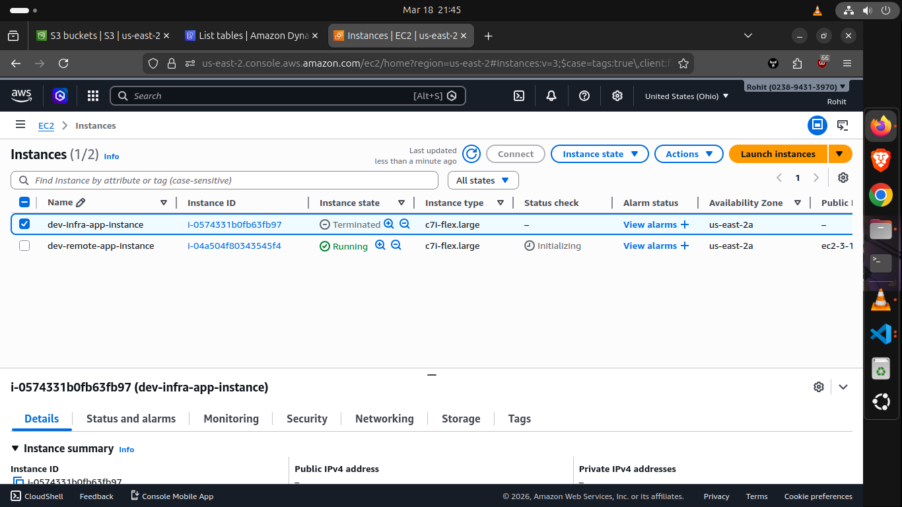
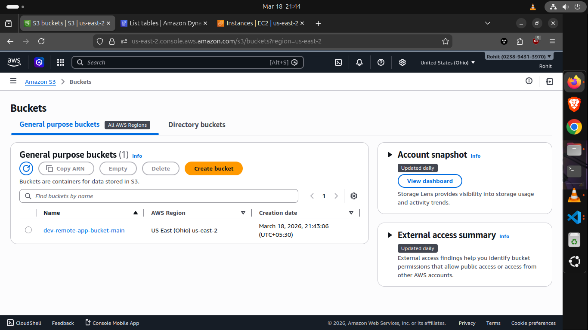
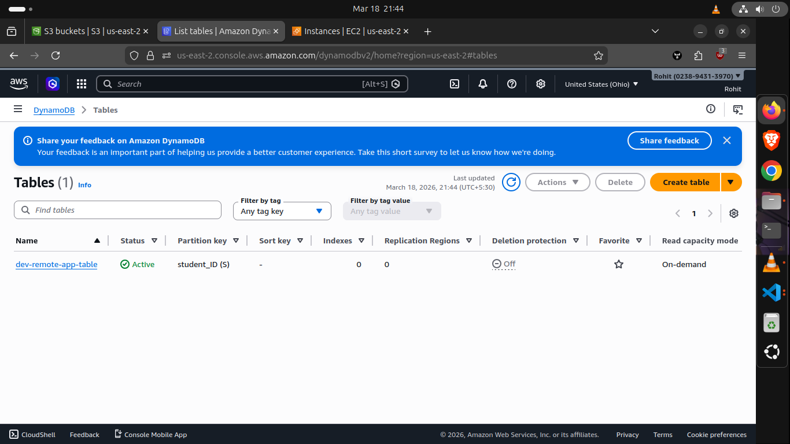
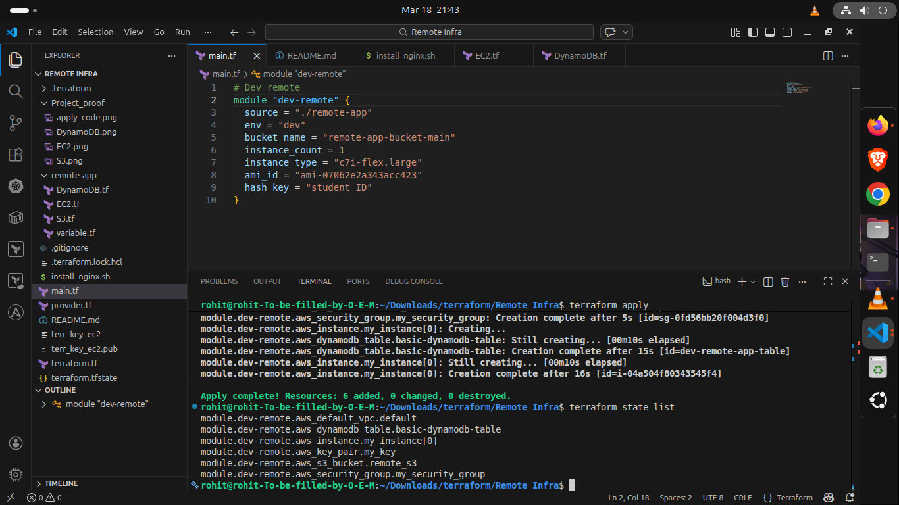
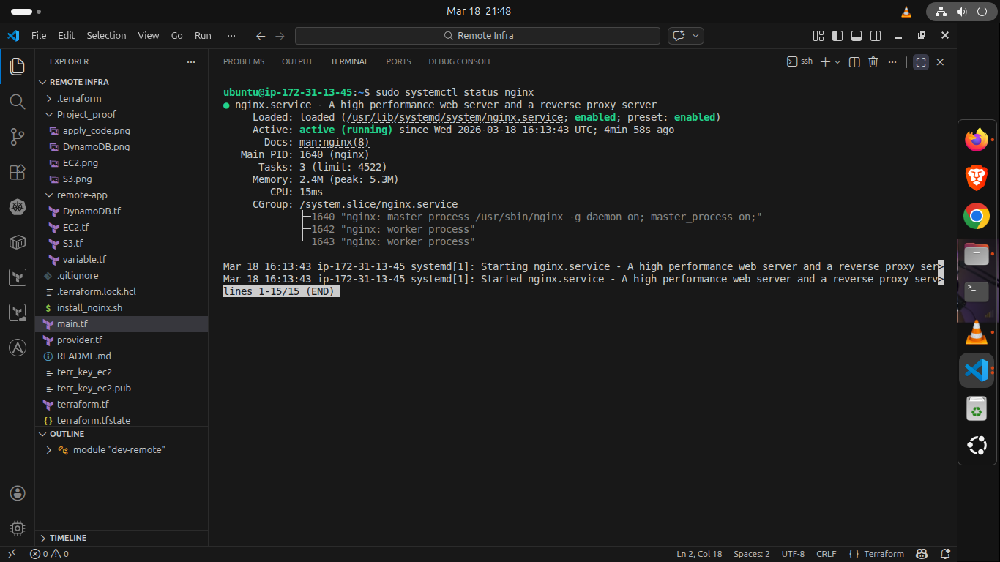
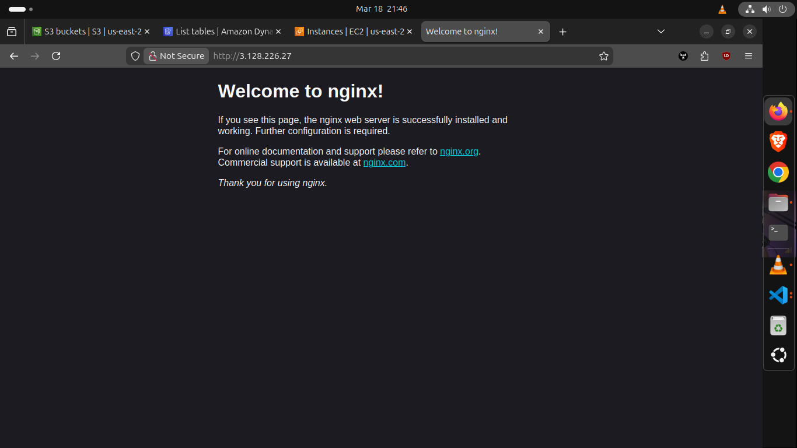

# AWS Remote Infrastructure with Terraform

This project automates the creation of a remote development infrastructure on AWS using Terraform. It provisions an EC2 instance with NGINX, an S3 Bucket, and a DynamoDB table as a modular setup.

## Architecture Highlights
- **EC2 Instance**: Provisions a `c7i-flex.large` instance and installs NGINX on boot via `install_nginx.sh`.
- **S3 Bucket**: Provisions an S3 bucket named `remote-app-bucket-main`.
- **DynamoDB Table**: Provisions a DynamoDB table using `student_ID` as the hash key.
- **Provider**: AWS region is set to `us-east-2`.
- **Modular Terraform**: Core resource creation is encapsulated within the `remote-app` module for easy scale and reuse.

## Prerequisites
- **Terraform** v1.x or higher installed.
- **AWS CLI** configured (`aws configure`) with an IAM user that has required permissions (EC2, S3, DynamoDB).
- Ensure `terr_key_ec2` key-pair files exist in the directory (included in this repository).

## How to Run

1. **Navigate to the Directory:**
   ```bash
   cd "REMOTE INFRA"
   ```

2. **Initialize Terraform:**
   Initialize the working directory containing Terraform configuration files. This downloads the necessary AWS provider.
   ```bash
   terraform init
   ```

3. **Validate the Configuration:**
   Verify the syntax of the Terraform files.
   ```bash
   terraform validate
   ```

4. **Plan the Deployment:**
   View the execution plan to see exactly what AWS resources will be created.
   ```bash
   terraform plan
   ```

5. **Apply the Infrastructure:**
   Deploy the resources to your AWS account. You'll be prompted to type `yes` before the deployment begins.
   ```bash
   terraform apply
   ```
   *Note: Ensure your EC2 security group allows inbound traffic on port 80 if you wish to access the NGINX welcome page.*

6. **Tear Down / Destroy:**
   To avoid unexpected cloud costs, destroy the resources after you are done testing.
   ```bash
   terraform destroy
   ```

## Proof of Execution

Below are screenshots demonstrating the successful application and deployment of all project resources.

### 1. Terraform Apply Code Output


### 2. EC2 Instance Provisioned


### 3. S3 Bucket Created


### 4. DynamoDB Table Deployed


### 5. State File Created


### 6. Verify NGINX Installation


### 7. NGINX Web Page Access
